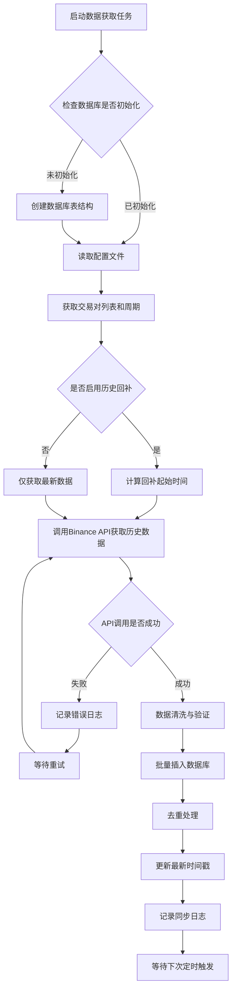
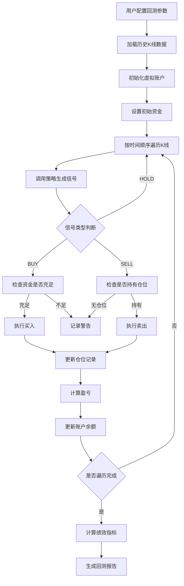
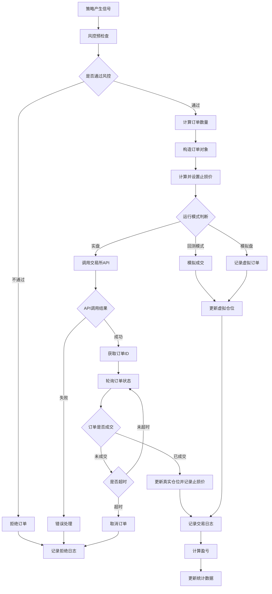
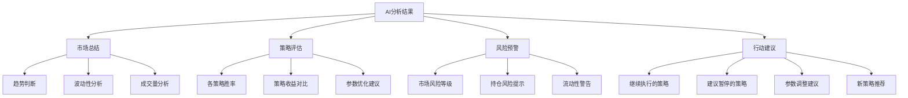
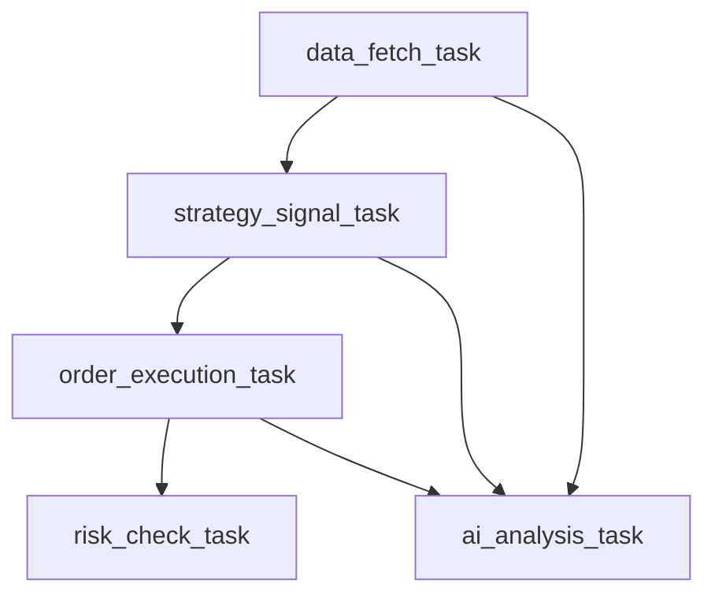

# 🧠 QuantAITrade — 智能量化交易系统

> **注意**：本文档是项目的完整设计说明，请将其内容同步到项目根目录的 `README.md` 文件

## 📋 项目简介

**QuantAITrade** 是一个结合 **量化策略 + AI 分析 + 人工干预 + 可视化界面** 的综合性加密货币量化交易系统。

### 核心特性

- 🕒 自动获取并存储行情数据（支持增量更新和历史回补）
- ⚙️ 多策略动态加载与参数热更新
- 🤖 AI 每日分析与策略优化建议
- 📊 Web 可视化界面（Streamlit）
- 🧪 支持回测、模拟盘、实盘三种模式
- 🛡️ 灵活的多层风控机制（支持多种止损方式）
- 🔐 安全的配置管理（YAML + 环境变量）
- 🤝 模块化设计，易于扩展

### 设计理念

> "让 AI 帮助人思考，而非代替人决策"

- **人机协同**：AI 提供分析建议，人工做最终决策
- **灵活性**：三种运行模式适应不同场景
- **安全第一**：多层风控保护，测试网优先验证

```
QuantAITrade/
├── main.py                          # 系统启动入口
├── requirements.txt                 # Python依赖清单
├── .env.example                     # 环境变量模板
├── .gitignore                       # Git忽略配置
├── config/
│   ├── config.yaml                  # 主配置文件（运行模式、交易对、频率等）
│   ├── strategy_params.yaml         # 策略参数配置
│   ├── ai_settings.yaml             # AI分析配置
│   ├── risk_control.yaml            # 风控参数配置
│   └── settings.py                  # 配置加载器
│
├── data/
│   ├── fetcher.py                   # 行情数据获取（Binance API）
│   ├── db_manager.py                # SQLite数据库管理
│   ├── models.py                    # 数据模型定义
│   └── kline.db                     # 数据库文件（运行时生成）
│
├── strategy/
│   ├── base_strategy.py             # 策略基类接口
│   ├── ma_cross_strategy.py         # 均线交叉策略
│   ├── macd_mean_reversion.py       # MACD均值回归策略
│   ├── boll_strategy.py             # 布林带策略
│   └── strategy_loader.py           # 策略动态加载器
│
├── backtest/
│   ├── engine.py                    # 回测引擎核心
│   ├── performance_analyzer.py      # 绩效分析器
│   └── report_generator.py          # 回测报告生成
│
├── execution/
│   ├── order_manager.py             # 订单管理
│   ├── position_tracker.py          # 仓位跟踪
│   ├── risk_controller.py           # 风控检查（止损、仓位限制）
│   └── exchange_connector.py        # 交易所连接器
│
├── ai/
│   ├── ai_analyzer.py               # AI分析引擎（OpenAI GPT-5）
│   ├── daily_report.py              # 每日分析报告生成
│   ├── suggestion_parser.py         # AI建议解析器
│   └── prompt_templates.py          # AI提示词模板
│
├── orchestrator/
│   ├── scheduler.py                 # 任务调度器（APScheduler）
│   ├── task_manager.py              # 任务管理器
│   └── workflow.py                  # 工作流编排
│
├── ui/
│   ├── app.py                       # Web应用入口（Streamlit）
│   ├── pages/
│   │   ├── dashboard.py             # 仪表盘页面
│   │   ├── strategy_control.py      # 策略控制页面
│   │   ├── ai_review.py             # AI建议审核页面
│   │   └── backtest.py              # 回测可视化页面
│   └── components/
│       ├── charts.py                # 图表组件（Matplotlib/Plotly）
│       └── trade_log.py             # 交易日志组件
│
├── logs/
│   ├── system.log                   # 系统日志
│   ├── trade.log                    # 交易日志
│   └── ai.log                       # AI分析日志
│
└── tests/
    ├── test_strategies/
    ├── test_backtest/
    └── test_ai/
```

#### 配置管理优化方案

**采用 YAML 配置 + 环境变量结合的方式**：

**config.yaml 主配置结构**：

| 配置分类 | 配置项 | 说明 | 默认值 |
|---------|-------|------|--------|
| **运行模式** | run_mode | 运行模式选择 | manual |
| | options | 可选值列表 | manual / auto / hybrid |
| **交易对配置** | symbols | 交易币种列表 | BTCUSDT, ETHUSDT, SOLUSDT |
| | intervals | K线周期 | 15m, 1h, 4h, 1d |
| **数据更新** | fetch_interval_minutes | 数据抓取频率（分钟） | 60 |
| | enable_backfill | 是否启用历史回补 | true |
| | backfill_days | 回补天数 | 30 |
| **AI分析** | enable_ai_analysis | 是否启用AI分析 | true |
| | analysis_time | 执行时间（24小时制） | "09:00" |
| | model | AI模型选择 | gpt-5 |
| **风控参数** | max_position_percent | 单仓位资金占比上限 | 0.03 |
| | stop_loss_percent | 止损比例 | 0.02 |
| | max_daily_trades | 每日最大交易次数 | 10 |
| **日志配置** | log_level | 日志级别 | INFO |
| | log_retention_days | 日志保留天数 | 30 |

**环境变量管理（.env 文件）**：

| 变量名 | 说明 | 必需性 |
|-------|------|--------|
| BINANCE_API_KEY | 币安API密钥 | 必需 |
| BINANCE_API_SECRET | 币安API密钥 | 必需 |
| BINANCE_TESTNET | 是否使用测试网 | 可选（默认true） |
| OPENAI_API_KEY | OpenAI API密钥 | AI功能必需 |
| DATABASE_PATH | 数据库文件路径 | 可选 |
| LOG_DIRECTORY | 日志目录 | 可选 |

#### 数据库设计方案

**核心表结构说明**：

**kline_data 表（K线数据）**

| 字段名 | 数据类型 | 说明 | 约束 |
|-------|---------|------|------|
| id | INTEGER | 主键 | PRIMARY KEY |
| symbol | TEXT | 交易对 | NOT NULL |
| interval | TEXT | K线周期 | NOT NULL |
| open_time | INTEGER | 开盘时间戳 | NOT NULL |
| open | REAL | 开盘价 | NOT NULL |
| high | REAL | 最高价 | NOT NULL |
| low | REAL | 最低价 | NOT NULL |
| close | REAL | 收盘价 | NOT NULL |
| volume | REAL | 交易量 | NOT NULL |
| close_time | INTEGER | 收盘时间戳 | NOT NULL |
| quote_volume | REAL | 成交额 | - |
| trades_count | INTEGER | 交易笔数 | - |
| created_at | INTEGER | 记录创建时间 | DEFAULT CURRENT_TIMESTAMP |

**唯一索引**：symbol + interval + open_time

**strategy_signals 表（策略信号）**

| 字段名 | 数据类型 | 说明 |
|-------|---------|------|
| id | INTEGER | 主键 |
| strategy_name | TEXT | 策略名称 |
| symbol | TEXT | 交易对 |
| signal_type | TEXT | 信号类型（BUY/SELL/HOLD） |
| price | REAL | 信号价格 |
| timestamp | INTEGER | 信号时间 |
| parameters | TEXT | 策略参数（JSON格式） |
| confidence | REAL | 信号置信度 |

**trade_records 表（交易记录）**

| 字段名 | 数据类型 | 说明 |
|-------|---------|------|
| id | INTEGER | 主键 |
| symbol | TEXT | 交易对 |
| side | TEXT | 方向（BUY/SELL） |
| order_type | TEXT | 订单类型 |
| price | REAL | 成交价格 |
| quantity | REAL | 成交数量 |
| status | TEXT | 订单状态 |
| order_id | TEXT | 交易所订单ID |
| strategy_name | TEXT | 触发策略 |
| timestamp | INTEGER | 交易时间 |
| pnl | REAL | 盈亏金额 |
| pnl_percent | REAL | 盈亏比例 |

**ai_analysis_log 表（AI分析记录）**

| 字段名 | 数据类型 | 说明 |
|-------|---------|------|
| id | INTEGER | 主键 |
| analysis_date | TEXT | 分析日期 |
| market_summary | TEXT | 市场总结 |
| suggestions | TEXT | 策略建议（JSON格式） |
| risk_alert | TEXT | 风险提示 |
| model_version | TEXT | AI模型版本 |
| created_at | INTEGER | 创建时间 |

**backtest_results 表（回测结果）**

| 字段名 | 数据类型 | 说明 |
|-------|---------|------|
| id | INTEGER | 主键 |
| strategy_name | TEXT | 策略名称 |
| symbol | TEXT | 交易对 |
| start_date | TEXT | 回测开始日期 |
| end_date | TEXT | 回测结束日期 |
| initial_capital | REAL | 初始资金 |
| final_capital | REAL | 最终资金 |
| total_return | REAL | 总收益率 |
| sharpe_ratio | REAL | 夏普比率 |
| max_drawdown | REAL | 最大回撤 |
| win_rate | REAL | 胜率 |
| parameters | TEXT | 策略参数（JSON） |
| created_at | INTEGER | 回测时间 |

## 二、系统核心功能设计

### 2.1 数据获取与管理模块

**职责**：从币安API获取实时和历史K线数据，存储到SQLite数据库

**核心流程**：



**关键逻辑说明**：

- **增量更新机制**：查询数据库中每个交易对的最新时间戳，仅获取该时间之后的数据
- **去重策略**：通过 symbol + interval + open_time 唯一索引自动防止重复插入
- **错误处理**：API限流时采用指数退避重试，最多重试3次
- **数据完整性检查**：验证K线数据的时间连续性，发现缺失时触发补全

### 2.2 策略系统设计

**策略基类接口定义**：

| 方法名 | 输入参数 | 返回值 | 说明 |
|-------|---------|--------|------|
| initialize | config: dict | None | 策略初始化，加载参数 |
| on_data | kline_data: DataFrame | Signal | 接收K线数据，生成交易信号 |
| get_parameters | None | dict | 获取当前策略参数 |
| update_parameters | params: dict | bool | 动态更新策略参数 |
| validate | None | bool | 参数有效性验证 |

**信号对象结构**：

| 属性 | 类型 | 说明 |
|-----|------|------|
| signal_type | str | BUY / SELL / HOLD |
| price | float | 建议价格 |
| quantity | float | 建议数量 |
| confidence | float | 信号置信度 (0-1) |
| reason | str | 信号产生原因 |
| timestamp | int | 信号时间戳 |

**内置策略说明**：

**MA交叉策略（ma_cross_strategy）**

| 参数名 | 默认值 | 说明 |
|-------|--------|------|
| short_window | 5 | 短期均线周期 |
| long_window | 20 | 长期均线周期 |
| min_cross_distance | 0.001 | 最小交叉距离（过滤假信号） |

**信号逻辑**：
- 短期均线上穿长期均线 → BUY信号
- 短期均线下穿长期均线 → SELL信号
- 交叉角度过小时忽略信号

**MACD均值回归策略（macd_mean_reversion）**

| 参数名 | 默认值 | 说明 |
|-------|--------|------|
| fast_period | 12 | 快线周期 |
| slow_period | 26 | 慢线周期 |
| signal_period | 9 | 信号线周期 |
| histogram_threshold | 0.0 | 柱状图阈值 |

**信号逻辑**：
- MACD柱状图从负转正 → BUY信号
- MACD柱状图从正转负 → SELL信号
- 柱状图绝对值小于阈值时不产生信号

**布林带策略（boll_strategy）**

| 参数名 | 默认值 | 说明 |
|-------|--------|------|
| period | 20 | 布林带周期 |
| std_multiplier | 2.0 | 标准差倍数 |
| mean_reversion | true | 是否均值回归模式 |

**信号逻辑**：
- 均值回归模式：价格触及下轨 → BUY，触及上轨 → SELL
- 突破模式：价格突破上轨 → BUY，跌破下轨 → SELL

**策略动态加载机制**：


### 2.3 回测引擎设计

**回测流程**：



**绩效指标计算**：

| 指标名称 | 计算方法说明 | 意义 |
|---------|-------------|------|
| 总收益率 | (最终资金 - 初始资金) / 初始资金 | 整体盈利能力 |
| 年化收益率 | 总收益率 × (365 / 回测天数) | 标准化收益对比 |
| 夏普比率 | (年化收益 - 无风险利率) / 收益波动率 | 风险调整后收益 |
| 最大回撤 | 从峰值到谷值的最大跌幅百分比 | 风险承受能力 |
| 胜率 | 盈利交易次数 / 总交易次数 | 策略稳定性 |
| 盈亏比 | 平均盈利金额 / 平均亏损金额 | 单笔交易质量 |
| 卡玛比率 | 年化收益率 / 最大回撤 | 风险收益平衡 |

### 2.4 执行与风控模块

**订单执行流程**：



**风控规则检查**：

| 风控项 | 检查逻辑 | 触发动作 |
|-------|---------|---------|
| 单仓位限制 | 订单金额 ≤ 总资金 × max_position_percent | 拒绝订单 |
| 止损检查 | 当前价格跌破买入价 × (1 - stop_loss_percent) | 强制平仓 |
| 每日交易次数 | 当日交易次数 < max_daily_trades | 拒绝新订单 |
| 总仓位限制 | 所有持仓市值 ≤ 总资金 × 0.8 | 拒绝开仓 |
| 账户余额检查 | 可用余额 ≥ 订单所需金额 | 拒绝订单 |
| 价格偏差检查 | 订单价格与市价偏差 < 1% | 拒绝订单 |

**止损止盈逻辑**：

- **固定止损**：买入后设置止损价 = 买入价 × (1 - stop_loss_percent)
- **移动止盈**：价格上涨后，止损价跟随上移，保护浮盈
- **时间止损**：持仓超过N天未盈利自动平仓
- **触发方式**：系统定时检查所有持仓，满足条件立即触发市价平仓

### 2.5 AI分析模块

**AI分析触发机制**：

- **定时触发**：每日固定时间（默认09:00）执行
- **手动触发**：通过Web界面手动发起分析
- **事件触发**：市场波动超过阈值时自动分析

**AI分析输入数据**：

| 数据类型 | 数据范围 | 用途 |
|---------|---------|------|
| 市场K线数据 | 近30天全周期数据 | 市场趋势判断 |
| 策略信号历史 | 近7天所有策略信号 | 策略有效性评估 |
| 交易记录 | 近30天交易明细 | 盈亏分析 |
| 账户状态 | 当前余额和持仓 | 风险评估 |
| 外部新闻（可选） | 加密货币相关新闻 | 情绪分析 |

**AI分析输出结构**：



**建议格式**（JSON结构）：

| 字段名 | 类型 | 说明 |
|-------|------|------|
| date | string | 分析日期 |
| market_trend | string | 市场趋势（bullish/bearish/neutral） |
| risk_level | string | 风险等级（low/medium/high） |
| strategy_suggestions | array | 策略建议列表 |
| ├─ strategy_name | string | 策略名称 |
| ├─ action | string | 建议操作（continue/pause/adjust） |
| ├─ reason | string | 原因说明 |
| ├─ new_parameters | object | 建议的新参数（如果action=adjust） |
| risk_alerts | array | 风险提示列表 |
| next_review_time | string | 下次建议复核时间 |

**人工审核界面**：

- 展示AI完整分析报告
- 对比当前策略参数与AI建议参数
- 提供一键应用或手动调整选项
- 记录审核决策与理由
- 支持部分接受建议

### 2.6 任务调度系统

**调度器架构**：

使用 APScheduler 实现多任务调度，支持三种触发方式：

| 触发器类型 | 使用场景 | 配置示例 |
|-----------|---------|---------|
| interval | 周期性任务 | 每60分钟更新数据 |
| cron | 定时任务 | 每天09:00执行AI分析 |
| date | 一次性任务 | 指定时间执行回测 |

**核心调度任务**：

| 任务名称 | 触发类型 | 默认频率 | 优先级 | 说明 |
|---------|---------|---------|--------|------|
| data_fetch_task | interval | 60分钟 | 高 | 获取最新K线数据 |
| strategy_signal_task | interval | 15分钟 | 高 | 执行策略生成信号 |
| order_execution_task | interval | 5分钟 | 最高 | 检查并执行待处理订单 |
| risk_check_task | interval | 5分钟 | 最高 | 止损检查与风控 |
| ai_analysis_task | cron | 每天09:00 | 中 | AI每日分析 |
| database_cleanup_task | cron | 每周日02:00 | 低 | 清理过期日志数据 |
| health_check_task | interval | 10分钟 | 中 | 系统健康检查 |

**任务依赖关系**：



**异常处理策略**：

- 任务执行失败时记录详细错误日志
- 支持自动重试（最多3次，间隔递增）
- 连续失败超过阈值时发送告警通知
- 关键任务失败时暂停依赖任务
- 提供手动恢复接口

### 2.7 Web界面设计

**技术选型**：使用 Streamlit 构建Web界面（易于快速开发，适合数据可视化）

**页面结构**：

**仪表盘页面（Dashboard）**

显示内容：
- 账户总览（总资产、可用余额、持仓市值）
- 今日盈亏统计
- 实时行情图表（主要交易对）
- 最近交易记录
- 系统运行状态

**策略控制页面（Strategy Control）**

功能模块：
- 已启用策略列表（显示状态、参数、当日信号数）
- 策略启停控制开关
- 参数实时调整表单
- 策略性能对比图表
- 添加/删除策略

**AI建议审核页面（AI Review）**

界面布局：
- 最新AI分析报告展示
- 市场趋势可视化
- 策略建议对比表（当前参数 vs 建议参数）
- 风险提示高亮显示
- 建议接受/拒绝操作按钮
- 历史审核决策记录

**回测可视化页面（Backtest）**

交互功能：
- 回测参数配置表单（时间范围、初始资金、策略选择）
- 启动回测按钮
- 回测进度条
- 收益曲线图
- 回撤曲线图
- 交易点位标记
- 绩效指标卡片
- 导出报告功能

**图表组件**：

| 图表类型 | 使用库 | 用途 |
|---------|-------|------|
| K线图 | Plotly | 价格走势与交易点位 |
| 折线图 | Matplotlib | 收益曲线、指标曲线 |
| 柱状图 | Plotly | 交易量、盈亏分布 |
| 饼图 | Plotly | 资产分布、策略占比 |
| 热力图 | Seaborn | 相关性分析 |

### 2.8 运行模式设计

**三种运行模式说明**：

**manual（人工模式）**

特征：
- 系统仅提供数据和信号，不自动执行交易
- 策略生成信号后需人工审核确认
- 适合谨慎型交易者或策略验证阶段

工作流：
数据更新 → 策略分析 → 生成信号 → **人工审核** → 手动执行

**auto（全自动模式）**

特征：
- 策略信号通过风控检查后自动执行
- AI分析结果仅供参考，不干预交易
- 适合成熟策略的自动化运行

工作流：
数据更新 → 策略分析 → 生成信号 → 风控检查 → **自动执行**

**hybrid（混合模式）**

特征：
- 策略信号自动执行
- AI每日分析后需人工审核建议
- 人工可随时干预策略参数
- 平衡自动化与人工智慧

工作流：
数据更新 → 策略分析 → 生成信号 → 自动执行 → AI分析 → **人工审核AI建议** → 参数调整

**模式切换逻辑**：

- 支持配置文件预设
- 支持Web界面动态切换
- 切换时需确认当前无待执行订单
- 记录模式切换历史

## 三、系统实现关键技术点

### 3.1 数据一致性保证

**问题**：多任务并发访问数据库可能导致数据冲突

**解决方案**：

- 使用 SQLite 的 WAL 模式（Write-Ahead Logging）提升并发性能
- 数据库连接池管理（每个线程独立连接）
- 关键操作使用事务确保原子性
- 乐观锁机制防止数据覆盖

### 3.2 API限流处理

**币安API限流规则**：

| 限制类型 | 阈值 | 时间窗口 |
|---------|------|---------|
| 请求频率 | 1200次 | 1分钟 |
| 订单频率 | 10次 | 1秒 |
| WebSocket连接 | 5个 | 单IP |

**应对策略**：

- 实现请求队列，控制发送速率
- 缓存行情数据，减少重复请求
- 批量请求优化（一次获取多个交易对）
- 监控剩余配额，动态调整请求频率
- 失败时指数退避重试

### 3.3 AI提示词工程

**提示词模板结构**：

角色设定：
你是一位专业的加密货币量化交易分析师，拥有丰富的技术分析和风险管理经验。

输入数据说明：
提供市场数据、策略表现、交易记录等结构化数据

分析要求：
1. 评估当前市场趋势与波动性
2. 分析各策略近期表现与适用性
3. 识别潜在风险点
4. 提供具体可执行的参数调整建议

输出格式要求：
必须返回严格的JSON格式，包含指定字段

约束条件：
- 建议必须基于数据事实
- 参数调整幅度不超过20%
- 必须说明建议理由

### 3.4 异常监控与告警

**监控指标**：

| 监控项 | 阈值 | 告警方式 |
|-------|------|---------|
| 数据更新延迟 | > 2小时 | 日志 + 邮件 |
| API调用失败率 | > 10% | 日志 |
| 单日亏损 | > 5% | 短信 + 邮件 |
| 策略连续失败 | > 5次 | 自动暂停 + 通知 |
| 数据库连接失败 | 任意 | 立即告警 |
| 系统内存占用 | > 80% | 日志 |

**日志分级策略**：

- DEBUG：详细的变量值、中间计算结果
- INFO：正常业务流程（数据更新完成、订单执行）
- WARNING：异常但可恢复（API重试、信号被风控拒绝）
- ERROR：严重错误（数据库连接失败、交易执行失败）
- CRITICAL：系统级故障（内存溢出、崩溃）

### 3.5 安全性设计

**敏感信息保护**：

- API密钥通过环境变量存储，禁止硬编码
- 日志中自动脱敏处理密钥信息
- 数据库文件设置访问权限
- Web界面需要身份认证（后续扩展）

**交易安全**：

- 实盘模式需二次确认
- 订单金额上限限制
- 异常订单人工介入机制
- 交易日志不可篡改

**代码安全**：

- 输入参数严格验证
- 防止SQL注入（使用参数化查询）
- 定期依赖库安全更新

## 四、实施计划

### 4.1 开发阶段划分

**第一阶段：基础设施搭建**

交付物：
- 项目目录结构创建
- 配置文件系统实现
- 数据库表结构创建
- 日志系统初始化
- 环境依赖安装

验收标准：
- 配置文件能正确加载
- 数据库能成功初始化
- 日志能正常写入

**第二阶段：数据模块开发**

交付物：
- Binance API连接器
- K线数据获取功能
- 数据存储与查询
- 历史数据回补
- 数据完整性检查

验收标准：
- 能成功获取实时数据
- 历史数据回补准确
- 数据库无重复记录

**第三阶段：策略系统开发**

交付物：
- 策略基类实现
- 三个基础策略实现
- 策略动态加载器
- 信号生成与存储

验收标准：
- 策略能正确计算指标
- 信号准确且可追溯
- 支持参数动态修改

**第四阶段：回测引擎开发**

交付物：
- 回测引擎核心逻辑
- 绩效分析器
- 回测报告生成器
- 回测参数优化工具

验收标准：
- 回测结果可复现
- 绩效指标计算准确
- 报告清晰易读

**第五阶段：执行与风控**

交付物：
- 订单管理器
- 交易所连接器
- 风控规则引擎
- 止损止盈逻辑
- 仓位跟踪器

验收标准：
- 模拟盘交易正常
- 风控规则有效拦截
- 止损能及时触发

**第六阶段：AI分析模块**

交付物：
- AI分析引擎
- 提示词模板
- 建议解析器
- 每日报告生成
- 人工审核界面

验收标准：
- AI能生成合理建议
- 建议格式规范
- 审核流程流畅

**第七阶段：任务调度**

交付物：
- APScheduler集成
- 多任务调度配置
- 任务依赖管理
- 异常恢复机制

验收标准：
- 任务准时执行
- 依赖关系正确
- 失败能自动重试

**第八阶段：Web界面**

交付物：
- Streamlit应用框架
- 仪表盘页面
- 策略控制页面
- AI审核页面
- 回测页面
- 图表组件库

验收标准：
- 界面美观易用
- 数据实时更新
- 交互功能完整

**第九阶段：集成测试**

任务：
- 端到端流程测试
- 压力测试
- 异常场景测试
- 安全性测试

验收标准：
- 无关键Bug
- 性能达标
- 安全无漏洞

**第十阶段：文档与上线**

交付物：
- 用户使用手册
- 运维文档
- API文档
- 部署脚本

验收标准：
- 文档完整准确
- 新用户能快速上手
- 系统稳定运行

### 4.2 技术依赖清单

**核心依赖库**：

| 依赖库 | 版本要求 | 用途 |
|-------|---------|------|
| python | >= 3.10 | 运行环境 |
| ccxt | >= 4.0.0 | 交易所统一接口 |
| pandas | >= 2.0.0 | 数据处理 |
| numpy | >= 1.24.0 | 数值计算 |
| sqlite3 | 内置 | 数据库 |
| apscheduler | >= 3.10.0 | 任务调度 |
| openai | >= 1.0.0 | AI分析 |
| streamlit | >= 1.28.0 | Web界面 |
| plotly | >= 5.17.0 | 交互式图表 |
| matplotlib | >= 3.7.0 | 静态图表 |
| pyyaml | >= 6.0 | 配置文件解析 |
| python-dotenv | >= 1.0.0 | 环境变量管理 |
| requests | >= 2.31.0 | HTTP请求 |
| loguru | >= 0.7.0 | 日志管理 |

**开发工具依赖**：

| 工具 | 用途 |
|-----|------|
| pytest | 单元测试 |
| black | 代码格式化 |
| pylint | 代码质量检查 |
| mypy | 类型检查 |

### 4.3 README更新要点

**需要修改的部分**：

1. **架构图调整**：统一为单一标准架构（移除冲突的ui/app.py FastAPI描述）
2. **配置说明优化**：移除代码示例，改为表格化配置项说明
3. **Web框架明确**：统一使用Streamlit，移除FastAPI + React的描述
4. **新增章节**：
   - 环境变量配置说明
   - 数据库表结构说明
   - 运行模式详解
   - 故障排查指南
5. **完善启动流程**：增加初始化步骤说明
6. **安全注意事项**：强调API密钥保护

## 五、风险评估与应对

### 5.1 技术风险

| 风险项 | 影响 | 概率 | 应对措施 |
|-------|------|------|---------|
| API不稳定 | 数据缺失 | 中 | 多重试、降级策略 |
| 数据库性能瓶颈 | 查询慢 | 低 | 索引优化、分表 |
| AI接口费用高 | 成本增加 | 中 | 控制调用频率、缓存结果 |
| 策略过拟合 | 实盘亏损 | 高 | 多周期回测、样本外验证 |
| 并发冲突 | 数据错误 | 低 | 事务控制、锁机制 |

### 5.2 业务风险

| 风险项 | 影响 | 应对措施 |
|-------|------|---------|
| 市场极端波动 | 超预期亏损 | 强制止损、熔断机制 |
| 策略失效 | 持续亏损 | AI监控、人工干预 |
| 流动性不足 | 无法成交 | 交易对筛选、仓位控制 |
| 网络中断 | 系统失联 | 本地缓存、恢复机制 |

### 5.3 合规风险

| 风险项 | 应对措施 |
|-------|---------|
| 监管政策变化 | 关注政策动态、及时调整 |
| API服务条款 | 严格遵守调用限制 |
| 数据隐私 | 敏感信息加密存储 |

## 六、成功标准

### 6.1 功能完整性

- ✅ 支持至少3个交易对的数据获取
- ✅ 实现至少3种不同类型的策略
- ✅ 回测引擎能准确计算所有绩效指标
- ✅ AI分析能每日自动生成报告
- ✅ Web界面所有页面功能正常
- ✅ 三种运行模式均可正常工作

### 6.2 性能指标

- 数据更新延迟 < 5分钟
- 策略信号生成时间 < 10秒
- 回测1年数据耗时 < 30秒
- Web界面响应时间 < 2秒
- 系统连续稳定运行 > 7天

### 6.3 可靠性指标

- 数据准确率 100%（无缺失、无错误）
- 风控拦截成功率 100%
- 系统可用性 > 99%
- 日志完整性 100%

### 6.4 可维护性

- 代码注释覆盖率 > 60%
- 核心模块单元测试覆盖率 > 80%
- 配置修改无需改代码
- 新增策略仅需实现基类接口
