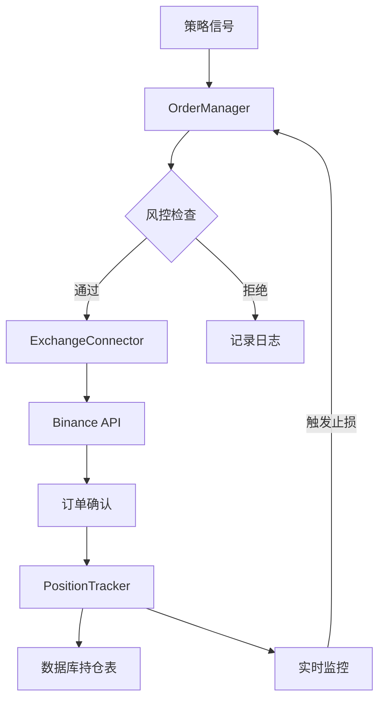
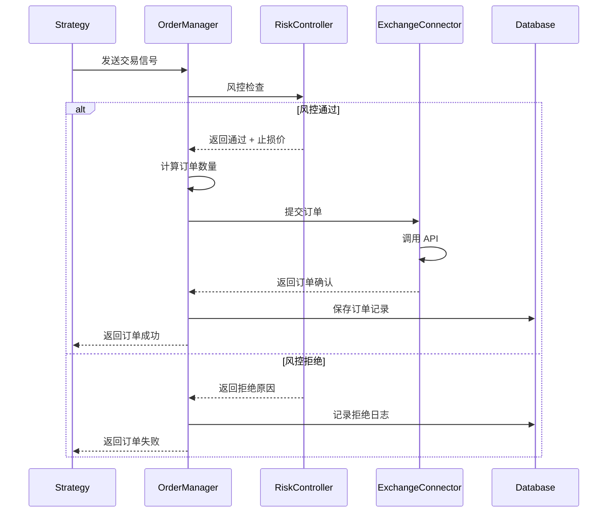
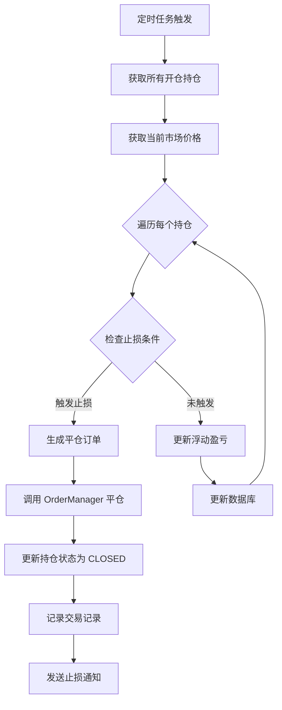
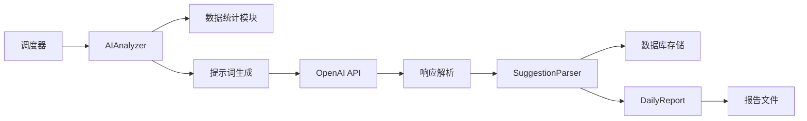
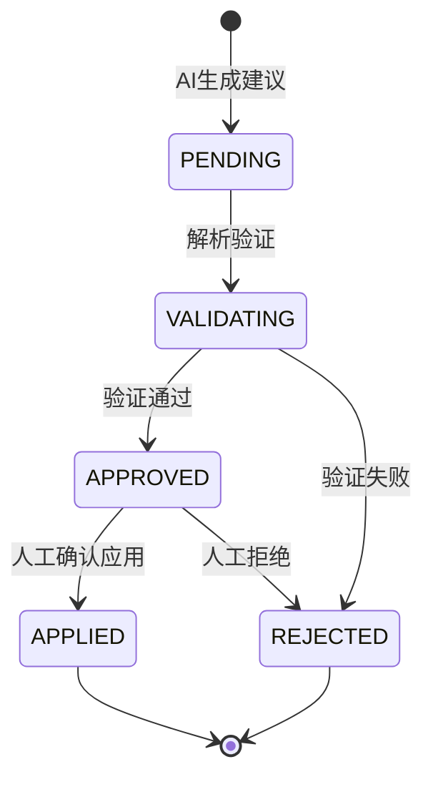
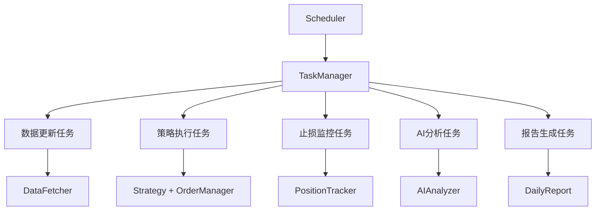
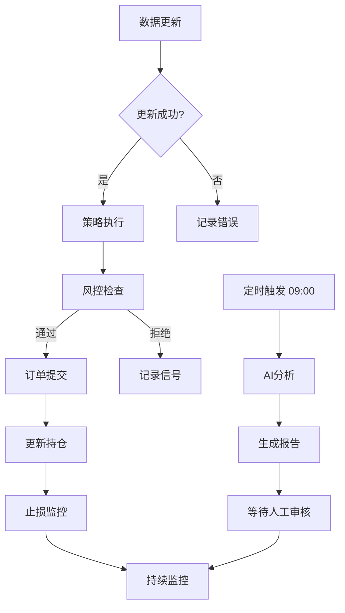
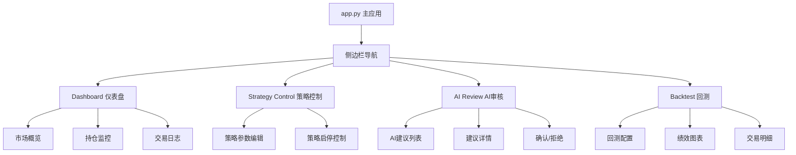
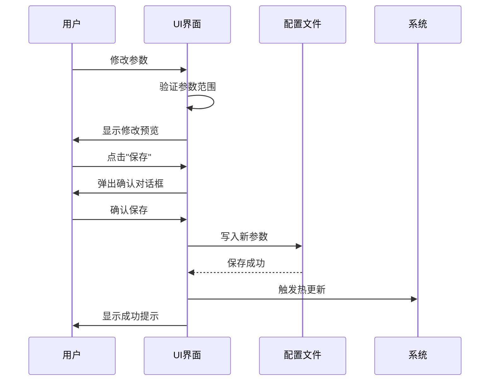
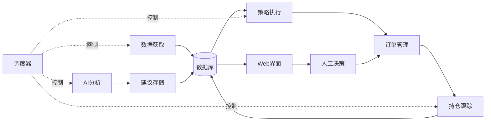

# QuantAITrade 剩余模块设计文档

## 📋 文档概述

本文档针对 QuantAITrade 量化交易系统的剩余 30% 功能模块进行详细设计，包括：
- 订单执行模块（execution）
- AI 分析模块（ai）
- 任务调度器（orchestrator）
- Web 界面（ui）

---

## 🎯 设计目标

### 核心目标
1. **完成交易闭环**：从策略信号到实际下单的完整执行流程
2. **集成 AI 智能**：提供每日市场分析与策略优化建议
3. **实现自动化**：通过任务调度器实现无人值守运行
4. **提升体验**：通过 Web 界面实现可视化管理与人工干预

### 设计原则
- **安全第一**：多层风控，测试网验证
- **模块解耦**：各模块独立运行，便于测试与维护
- **配置驱动**：所有参数可配置，避免硬编码
- **容错设计**：完善的异常处理与日志记录

---

## 🏗️ 模块一：订单执行模块（execution）

### 模块概述

订单执行模块负责将策略信号转化为实际的交易所订单，并跟踪持仓状态。

### 功能边界

**包含功能**：
- 交易所 API 封装与连接管理
- 订单创建、提交、查询、撤销
- 持仓实时跟踪与数据库同步
- 订单状态监控与异常处理
- 支持测试网与实盘切换

**不包含功能**：
- 风控检查（已在 risk_controller 模块实现）
- 策略信号生成（由 strategy 模块负责）
- 止损价格计算（已在 risk_controller 模块实现）

### 架构设计

#### 组件关系图



#### 核心组件

| 组件名称 | 文件路径 | 职责描述 |
|---------|---------|---------|
| ExchangeConnector | execution/exchange_connector.py | 交易所 API 封装，统一接口 |
| OrderManager | execution/order_manager.py | 订单生命周期管理 |
| PositionTracker | execution/position_tracker.py | 持仓跟踪与止损监控 |

---

### 详细设计：ExchangeConnector

#### 功能职责
- 封装 Binance API 交易接口
- 统一错误处理与重试机制
- 支持测试网与实盘环境切换
- 提供账户信息查询

#### 核心方法

| 方法名 | 参数 | 返回值 | 说明 |
|-------|------|--------|------|
| connect | - | bool | 建立连接，验证 API 密钥 |
| get_account_balance | - | dict | 获取账户余额信息 |
| place_market_order | symbol, side, quantity | Order | 下市价单 |
| place_limit_order | symbol, side, price, quantity | Order | 下限价单 |
| cancel_order | symbol, order_id | bool | 撤销订单 |
| get_order_status | symbol, order_id | OrderStatus | 查询订单状态 |
| get_open_orders | symbol | List[Order] | 获取未成交订单 |

#### 数据模型

**订单对象（Order）**：

| 字段名 | 类型 | 说明 |
|-------|------|------|
| symbol | str | 交易对 |
| order_id | str | 交易所订单 ID |
| client_order_id | str | 客户端订单 ID |
| side | OrderSide | BUY / SELL |
| order_type | OrderType | MARKET / LIMIT |
| price | float | 订单价格（限价单） |
| quantity | float | 订单数量 |
| executed_qty | float | 已成交数量 |
| status | OrderStatus | 订单状态 |
| created_time | int | 创建时间戳 |
| updated_time | int | 更新时间戳 |

**订单状态枚举（OrderStatus）**：
- NEW：新建
- PARTIALLY_FILLED：部分成交
- FILLED：完全成交
- CANCELED：已撤销
- REJECTED：被拒绝
- EXPIRED：已过期

#### 异常处理策略

| 异常类型 | 处理方式 |
|---------|---------|
| 网络超时 | 自动重试 3 次，间隔递增 |
| API 限流 | 等待限流窗口后重试 |
| 余额不足 | 记录日志，返回失败 |
| 订单被拒绝 | 记录详细原因，通知风控 |
| API 密钥无效 | 立即停止系统，发送警报 |

#### 配置参数

需在 `config/config.yaml` 中添加：

```yaml
exchange:
  name: "binance"
  use_testnet: true              # 是否使用测试网
  api_timeout: 30                # API 超时时间（秒）
  max_retries: 3                 # 最大重试次数
  retry_delay: 2                 # 重试延迟（秒）
  enable_rate_limit: true        # 是否启用限流保护
  orders_per_second: 5           # 每秒最大订单数
```

---

### 详细设计：OrderManager

#### 功能职责
- 管理订单完整生命周期
- 协调风控检查与订单提交
- 记录订单到数据库
- 提供订单查询接口

#### 核心方法

| 方法名 | 参数 | 返回值 | 说明 |
|-------|------|--------|------|
| create_order_from_signal | signal, account_balance, positions | Order 或 None | 基于策略信号创建订单 |
| submit_order | order | bool | 提交订单到交易所 |
| cancel_order | order_id | bool | 撤销指定订单 |
| get_order | order_id | Order | 查询订单信息 |
| get_recent_orders | symbol, limit | List[Order] | 获取最近订单 |
| sync_order_status | order_id | OrderStatus | 同步订单状态 |

#### 业务流程：创建订单



#### 订单数量计算规则

| 规则 | 计算公式 | 说明 |
|------|---------|------|
| 固定金额 | quantity = position_size / price | 根据配置的仓位金额计算 |
| 百分比 | quantity = (balance × percent) / price | 根据账户余额百分比计算 |
| 信号置信度 | quantity = base_qty × confidence | 根据信号置信度调整数量 |
| 最小数量限制 | max(quantity, min_qty) | 满足交易所最小下单量 |

**示例计算**：
- 账户余额：10,000 USDT
- 单仓位限制：3%
- 当前价格：45,000 USDT
- 信号置信度：0.8

```
可用资金 = 10,000 × 0.03 = 300 USDT
基础数量 = 300 / 45,000 = 0.00667 BTC
调整数量 = 0.00667 × 0.8 = 0.00534 BTC
```

#### 数据库交互

**写入 trade_records 表**：

| 字段 | 来源 | 说明 |
|------|------|------|
| symbol | signal.symbol | 交易对 |
| side | signal.signal_type | BUY/SELL |
| order_type | 固定 "MARKET" | 订单类型 |
| price | order.price | 成交价格 |
| quantity | order.quantity | 成交数量 |
| status | order.status | 订单状态 |
| order_id | order.order_id | 交易所 ID |
| strategy_name | signal.strategy_name | 策略名称 |
| timestamp | 当前时间 | 交易时间 |

---

### 详细设计：PositionTracker

#### 功能职责
- 跟踪所有开仓持仓
- 实时监控止损触发
- 计算持仓盈亏
- 自动平仓管理

#### 核心方法

| 方法名 | 参数 | 返回值 | 说明 |
|-------|------|--------|------|
| add_position | order | Position | 添加新持仓 |
| close_position | position_id, close_price | bool | 平仓 |
| update_position | position_id, current_price | Position | 更新持仓数据 |
| get_all_positions | - | List[Position] | 获取所有持仓 |
| get_position | symbol | Position 或 None | 获取指定交易对持仓 |
| check_stop_loss | current_prices | List[Position] | 检查所有持仓止损 |
| calculate_pnl | position, current_price | float | 计算浮动盈亏 |

#### 数据模型：Position

| 字段名 | 类型 | 说明 |
|-------|------|------|
| id | int | 持仓 ID（数据库主键） |
| symbol | str | 交易对 |
| side | str | 持仓方向（LONG/SHORT） |
| entry_price | float | 开仓价格 |
| quantity | float | 持仓数量 |
| stop_loss_price | float | 止损价格 |
| stop_loss_type | str | 止损类型 |
| entry_time | int | 开仓时间 |
| strategy_name | str | 触发策略 |
| order_id | str | 开仓订单 ID |
| unrealized_pnl | float | 浮动盈亏 |
| status | str | 持仓状态（OPEN/CLOSED） |

#### 止损监控流程



#### 止损触发条件

| 止损类型 | 触发条件 | 示例 |
|---------|---------|------|
| 固定百分比 | current_price ≤ stop_loss_price | 买入价 45000，止损价 43650（-3%） |
| 关键点位 | current_price ≤ support_level | 支撑位 44000 |
| 移动止损 | current_price ≤ highest_price × (1 - trailing_percent) | 最高价 48000，回撤 2%，止损价 47040 |
| 时间止损 | current_time - entry_time > max_holding_days | 持仓超过 30 天 |

#### 配置参数

需在 `config/config.yaml` 中添加：

```yaml
position_tracking:
  monitor_interval_seconds: 30     # 监控频率（秒）
  enable_auto_stop_loss: true      # 是否自动执行止损
  update_trailing_stop: true       # 是否更新移动止损
  trailing_update_threshold: 0.005 # 移动止损更新阈值（0.5%）
  max_positions: 10                # 最大同时持仓数
```

---

## 🤖 模块二：AI 分析模块（ai）

### 模块概述

AI 分析模块利用大语言模型对市场数据、策略表现进行分析，生成每日报告与优化建议。

### 功能边界

**包含功能**：
- 市场数据统计分析
- 策略绩效评估
- 生成结构化建议（JSON 格式）
- 每日报告生成（文本 + 数据）
- 建议解析与存储

**不包含功能**：
- AI 建议的自动执行（需人工审核）
- 模型训练与微调
- 实时交易决策（仅日报）

### 架构设计

#### 组件关系图



#### 核心组件

| 组件名称 | 文件路径 | 职责描述 |
|---------|---------|---------|
| AIAnalyzer | ai/ai_analyzer.py | AI 分析引擎核心 |
| DailyReport | ai/daily_report.py | 每日报告生成 |
| SuggestionParser | ai/suggestion_parser.py | AI 建议解析与验证 |
| PromptTemplates | ai/prompt_templates.py | 提示词模板管理 |

---

### 详细设计：AIAnalyzer

#### 功能职责
- 从数据库提取分析数据
- 构建 AI 提示词
- 调用 OpenAI API
- 解析 AI 响应

#### 核心方法

| 方法名 | 参数 | 返回值 | 说明 |
|-------|------|--------|------|
| run_daily_analysis | date | AnalysisResult | 执行每日分析 |
| prepare_data | date, lookback_days | dict | 准备分析数据 |
| build_prompt | data | str | 构建提示词 |
| call_openai_api | prompt | str | 调用 AI 接口 |
| parse_response | response | AnalysisResult | 解析响应 |
| save_to_database | result | bool | 保存分析结果 |

#### 分析数据结构

**输入数据（准备阶段）**：

| 数据项 | 来源 | 说明 |
|-------|------|------|
| 市场行情 | kline_data 表 | 最近 7 天各交易对价格走势 |
| 策略信号 | strategy_signals 表 | 最近 7 天策略信号统计 |
| 交易记录 | trade_records 表 | 最近 7 天交易记录与盈亏 |
| 持仓状态 | positions 表 | 当前所有持仓 |
| 回测结果 | backtest_results 表 | 最近策略回测绩效 |

**统计指标**：

| 指标名称 | 计算方式 | 用途 |
|---------|---------|------|
| 市场趋势 | 7日均线斜率 | 判断多空方向 |
| 波动率 | 7日标准差 | 评估风险水平 |
| 策略胜率 | 盈利交易数 / 总交易数 | 策略有效性 |
| 平均盈亏比 | 平均盈利 / 平均亏损 | 策略质量 |
| 信号频率 | 每日平均信号数 | 策略活跃度 |

#### 提示词模板

**系统角色提示**：

```
你是一位专业的加密货币量化交易分析师，擅长技术分析和策略优化。
请基于以下数据，生成专业的每日分析报告。
```

**分析任务提示**：

```
请分析以下市场与策略数据：

市场数据：
- BTC 7日涨跌幅：{btc_change}%
- ETH 7日涨跌幅：{eth_change}%
- 市场波动率：{volatility}
- 趋势方向：{trend}

策略表现：
- MA交叉策略胜率：{ma_win_rate}%
- 平均盈亏比：{avg_pnl_ratio}
- 最大回撤：{max_drawdown}%
- 本周交易次数：{trade_count}

当前持仓：
{positions_summary}

请提供：
1. 市场趋势总结（100字以内）
2. 策略表现评价（针对每个策略）
3. 风险提示（如有）
4. 策略参数优化建议（JSON格式）

建议格式示例：
{
  "ma_cross": {
    "short_window": 5,
    "long_window": 20,
    "confidence_threshold": 0.7,
    "reason": "市场震荡，建议提高置信度阈值"
  }
}
```

#### 输出数据结构

**AnalysisResult 对象**：

| 字段名 | 类型 | 说明 |
|-------|------|------|
| analysis_date | str | 分析日期 |
| market_summary | str | 市场总结文本 |
| strategy_evaluations | dict | 策略评价（每个策略） |
| risk_alerts | list | 风险提示列表 |
| parameter_suggestions | dict | 参数优化建议（JSON） |
| confidence_score | float | AI 分析置信度 |
| model_version | str | 使用的模型版本 |
| created_at | int | 创建时间戳 |

**示例输出**：

```json
{
  "analysis_date": "2024-12-01",
  "market_summary": "BTC 本周上涨 5.2%，突破 45000 阻力位，市场情绪偏多头。ETH 跟随上涨 4.8%，波动率处于中等水平。",
  "strategy_evaluations": {
    "ma_cross": {
      "performance": "良好",
      "win_rate": 0.65,
      "issues": "震荡市容易产生假信号",
      "suggestion": "提高长周期参数或增加过滤条件"
    }
  },
  "risk_alerts": [
    "当前 BTC 持仓已达上限，建议谨慎加仓",
    "ETH 波动率升高，注意止损设置"
  ],
  "parameter_suggestions": {
    "ma_cross": {
      "short_window": 5,
      "long_window": 25,
      "confidence_threshold": 0.75,
      "reason": "延长长周期参数，过滤震荡假信号"
    }
  },
  "confidence_score": 0.82,
  "model_version": "gpt-4",
  "created_at": 1701398400
}
```

#### 异常处理

| 异常类型 | 处理方式 |
|---------|---------|
| OpenAI API 超时 | 重试 3 次，失败则记录日志跳过 |
| API 配额不足 | 发送警报，停止 AI 分析 |
| 响应格式错误 | 尝试解析部分内容，标记低置信度 |
| 数据不足 | 记录警告，生成简化报告 |

#### 配置参数

使用现有 `config/ai_settings.yaml`：

```yaml
openai:
  api_key_env: "OPENAI_API_KEY"
  model: "gpt-4"
  max_tokens: 2000
  temperature: 0.7
  timeout: 30
  max_retries: 3

analysis:
  schedule_time: "09:00"          # 每日执行时间
  lookback_days: 7                # 数据回看天数
  min_trades_for_analysis: 3      # 最少交易数
  enable_parameter_suggestion: true
  suggestion_confidence_threshold: 0.7  # 建议采纳阈值
```

---

### 详细设计：DailyReport

#### 功能职责
- 格式化 AI 分析结果
- 生成 Markdown 格式报告
- 生成 HTML 格式报告（可选）
- 保存报告文件

#### 核心方法

| 方法名 | 参数 | 返回值 | 说明 |
|-------|------|--------|------|
| generate_report | analysis_result | str | 生成报告内容 |
| save_to_file | content, date, format | str | 保存到文件，返回路径 |
| format_markdown | analysis_result | str | 格式化为 Markdown |
| format_html | analysis_result | str | 格式化为 HTML |
| attach_charts | analysis_result | list | 附加图表（可选） |

#### 报告模板

**Markdown 报告结构**：

```markdown
# QuantAITrade 每日分析报告

**日期**：2024-12-01  
**生成时间**：2024-12-01 09:00:00  
**AI 模型**：GPT-4  
**分析置信度**：82%

---

## 📊 市场概况

{market_summary}

---

## 📈 策略表现

### MA 交叉策略
- **表现评价**：{performance}
- **胜率**：{win_rate}%
- **存在问题**：{issues}
- **优化建议**：{suggestion}

---

## ⚠️ 风险提示

{risk_alerts 列表}

---

## 🎯 参数优化建议

| 策略 | 参数 | 当前值 | 建议值 | 理由 |
|------|------|--------|--------|------|
| MA交叉 | long_window | 20 | 25 | {reason} |

---

## 📋 详细数据

### 本周交易统计
- 交易次数：{trade_count}
- 盈利次数：{win_count}
- 亏损次数：{loss_count}
- 总盈亏：{total_pnl} USDT

### 当前持仓
{positions_table}

---

*报告由 AI 自动生成，建议仅供参考，请结合实际情况做出决策。*
```

#### 报告存储

| 存储位置 | 文件名格式 | 说明 |
|---------|-----------|------|
| logs/ai_reports/ | daily_report_{date}.md | Markdown 格式 |
| logs/ai_reports/ | daily_report_{date}.html | HTML 格式（可选） |
| logs/ai_reports/ | daily_report_{date}.json | JSON 原始数据 |

---

### 详细设计：SuggestionParser

#### 功能职责
- 验证 AI 建议格式
- 解析参数建议
- 评估建议合理性
- 标记建议状态

#### 核心方法

| 方法名 | 参数 | 返回值 | 说明 |
|-------|------|--------|------|
| parse_suggestions | raw_suggestions | dict | 解析建议 JSON |
| validate_parameters | strategy_name, params | bool | 验证参数合法性 |
| check_safety | old_params, new_params | bool | 检查参数变化安全性 |
| mark_suggestion_status | suggestion | str | 标记状态（PENDING/APPROVED/REJECTED） |

#### 验证规则

| 验证项 | 规则 | 示例 |
|-------|------|------|
| 参数范围 | 必须在策略允许范围内 | short_window: 3-10 |
| 参数关系 | short < long（均线策略） | short=5, long=20 ✓ |
| 变化幅度 | 单次调整不超过 30% | 20 → 25 ✓，20 → 40 ✗ |
| 风控参数 | 止损比例不低于 1% | stop_loss ≥ 0.01 |

#### 建议状态流转



---

## ⏱️ 模块三：任务调度器（orchestrator）

### 模块概述

任务调度器负责协调各模块按计划执行，实现系统自动化运行。

### 功能边界

**包含功能**：
- 定时任务调度
- 任务依赖管理
- 任务执行监控
- 错误重试与告警

**不包含功能**：
- 具体业务逻辑（由各模块实现）
- 分布式调度（单机版）

### 架构设计

#### 组件关系图



#### 核心组件

| 组件名称 | 文件路径 | 职责描述 |
|---------|---------|---------|
| Scheduler | orchestrator/scheduler.py | APScheduler 集成与调度管理 |
| TaskManager | orchestrator/task_manager.py | 任务注册与生命周期管理 |
| Workflow | orchestrator/workflow.py | 工作流编排与依赖控制 |

---

### 详细设计：Scheduler

#### 功能职责
- 初始化 APScheduler
- 注册定时任务
- 监控任务执行
- 处理任务异常

#### 任务配置表

| 任务名称 | 执行频率 | 执行时间 | 依赖任务 | 说明 |
|---------|---------|---------|---------|------|
| 数据更新 | 每小时 | 整点 | - | 获取最新 K 线数据 |
| 策略执行 | 每 15 分钟 | - | 数据更新 | 生成交易信号 |
| 止损监控 | 每 30 秒 | - | - | 检查持仓止损 |
| AI 分析 | 每日一次 | 09:00 | - | 生成每日报告 |
| 报告生成 | 每日一次 | 09:05 | AI 分析 | 保存报告文件 |
| 数据库备份 | 每周一次 | 周日 03:00 | - | 备份数据库 |

#### 核心方法

| 方法名 | 参数 | 返回值 | 说明 |
|-------|------|--------|------|
| init_scheduler | - | bool | 初始化调度器 |
| add_job | task, trigger, time | str | 添加任务，返回 job_id |
| remove_job | job_id | bool | 移除任务 |
| pause_job | job_id | bool | 暂停任务 |
| resume_job | job_id | bool | 恢复任务 |
| get_job_status | job_id | dict | 获取任务状态 |
| start | - | None | 启动调度器 |
| shutdown | - | None | 关闭调度器 |

#### 任务注册示例

**数据更新任务**：
- 触发器类型：cron
- 执行时间：每小时整点
- 回调函数：data_fetcher.fetch_all_configured_symbols()

**策略执行任务**：
- 触发器类型：interval
- 执行间隔：15 分钟
- 回调函数：strategy_executor.run_all_strategies()

**止损监控任务**：
- 触发器类型：interval
- 执行间隔：30 秒
- 回调函数：position_tracker.check_stop_loss()

**AI 分析任务**：
- 触发器类型：cron
- 执行时间：每日 09:00
- 回调函数：ai_analyzer.run_daily_analysis()

#### 异常处理策略

| 异常类型 | 处理方式 |
|---------|---------|
| 任务执行超时 | 记录日志，发送警报，跳过本次 |
| 任务执行失败 | 重试 3 次，仍失败则暂停任务 |
| 数据库锁定 | 等待 10 秒后重试 |
| 网络异常 | 等待 1 分钟后重试 |

#### 配置参数

需在 `config/config.yaml` 中添加：

```yaml
scheduler:
  timezone: "Asia/Shanghai"
  max_instances: 3                  # 同一任务最大并发实例数
  misfire_grace_time: 60            # 错过执行的容忍时间（秒）
  coalesce: true                    # 合并错过的执行
  job_defaults:
    max_retries: 3
    retry_interval: 60
  
  tasks:
    data_update:
      enabled: true
      cron: "0 * * * *"              # 每小时整点
    
    strategy_execution:
      enabled: true
      interval_minutes: 15
    
    stop_loss_monitor:
      enabled: true
      interval_seconds: 30
    
    ai_analysis:
      enabled: true
      cron: "0 9 * * *"              # 每日 09:00
    
    database_backup:
      enabled: true
      cron: "0 3 * * 0"              # 每周日 03:00
```

---

### 详细设计：TaskManager

#### 功能职责
- 任务注册与管理
- 任务执行日志
- 任务性能统计
- 任务健康检查

#### 核心方法

| 方法名 | 参数 | 返回值 | 说明 |
|-------|------|--------|------|
| register_task | name, func, config | bool | 注册任务 |
| execute_task | task_name | dict | 执行任务并返回结果 |
| get_task_history | task_name, limit | list | 获取任务执行历史 |
| get_task_statistics | task_name | dict | 获取任务统计信息 |
| health_check | - | dict | 检查所有任务健康状态 |

#### 任务执行记录

**存储到数据库新表：task_execution_log**

| 字段名 | 类型 | 说明 |
|-------|------|------|
| id | INTEGER | 主键 |
| task_name | TEXT | 任务名称 |
| start_time | INTEGER | 开始时间 |
| end_time | INTEGER | 结束时间 |
| duration | REAL | 执行时长（秒） |
| status | TEXT | 状态（SUCCESS/FAILED/TIMEOUT） |
| error_message | TEXT | 错误信息 |
| result_summary | TEXT | 结果摘要（JSON） |

#### 统计指标

| 指标名称 | 计算方式 | 用途 |
|---------|---------|------|
| 成功率 | 成功次数 / 总次数 | 任务稳定性 |
| 平均耗时 | sum(duration) / count | 性能评估 |
| 最近失败时间 | max(end_time) where status=FAILED | 故障追踪 |
| 连续失败次数 | 最近连续失败计数 | 告警触发 |

---

### 详细设计：Workflow

#### 功能职责
- 定义任务依赖关系
- 按依赖顺序执行
- 处理任务失败影响

#### 工作流定义

**混合模式工作流**：



#### 核心方法

| 方法名 | 参数 | 返回值 | 说明 |
|-------|------|--------|------|
| define_workflow | name, tasks, dependencies | Workflow | 定义工作流 |
| execute_workflow | workflow_name | dict | 执行工作流 |
| get_workflow_status | workflow_name | dict | 获取工作流状态 |

---

## 🖥️ 模块四：Web 界面（ui）

### 模块概述

Web 界面基于 Streamlit 构建，提供可视化管理与人工干预接口。

### 功能边界

**包含功能**：
- 仪表盘（数据可视化）
- 策略控制（参数调整）
- AI 建议审核（人工确认）
- 回测可视化

**不包含功能**：
- 移动端适配（后期考虑）
- 用户权限管理（单用户版本）

### 架构设计

#### 页面结构



#### 核心组件

| 组件名称 | 文件路径 | 职责描述 |
|---------|---------|---------|
| MainApp | ui/app.py | Streamlit 主应用入口 |
| Dashboard | ui/pages/dashboard.py | 仪表盘页面 |
| StrategyControl | ui/pages/strategy_control.py | 策略控制页面 |
| AIReview | ui/pages/ai_review.py | AI 审核页面 |
| BacktestPage | ui/pages/backtest.py | 回测页面 |
| Charts | ui/components/charts.py | 图表组件 |
| TradeLog | ui/components/trade_log.py | 交易日志组件 |

---

### 详细设计：Dashboard（仪表盘）

#### 页面布局

| 区域 | 内容 | 组件类型 |
|------|------|---------|
| 顶部 | 系统状态指示器 | 指标卡片 |
| 左上 | 市场概览（价格、涨跌幅） | 多列布局 + 图表 |
| 右上 | 账户信息（余额、总盈亏） | 指标卡片 |
| 中部 | 持仓监控表格 | 数据表 |
| 底部 | 最近交易日志 | 数据表 |

#### 功能清单

| 功能 | 实现方式 | 刷新频率 |
|------|---------|---------|
| 实时价格显示 | st.metric() | 60 秒 |
| K 线图表 | plotly.graph_objects | 手动刷新 |
| 持仓盈亏计算 | 查询数据库 + 实时价格 | 60 秒 |
| 止损价格显示 | 读取 positions 表 | 60 秒 |
| 交易日志过滤 | st.selectbox() 日期筛选 | 手动 |

#### 关键指标卡片

| 指标名称 | 计算方式 | 显示格式 |
|---------|---------|---------|
| 账户余额 | 从交易所 API 获取 | $10,245.32 |
| 总盈亏 | 所有已平仓 + 浮动盈亏 | +$1,245.67 (+12.4%) |
| 今日盈亏 | 当日交易盈亏 | +$123.45 |
| 持仓数量 | 开仓持仓计数 | 3 / 10 |
| 胜率 | 最近 30 天盈利交易比例 | 65% |

---

### 详细设计：StrategyControl（策略控制）

#### 页面布局

| 区域 | 内容 | 组件类型 |
|------|------|---------|
| 顶部 | 策略选择器 | st.selectbox() |
| 左侧 | 策略参数表单 | st.form() |
| 右侧 | 策略当前状态 | st.info() |
| 底部 | 参数历史记录 | st.dataframe() |

#### 功能清单

| 功能 | 实现方式 | 说明 |
|------|---------|------|
| 策略启停 | st.toggle() | 更新配置文件 |
| 参数编辑 | st.number_input() | 实时验证范围 |
| 参数保存 | st.button() + YAML 写入 | 需确认提示 |
| 参数回滚 | 读取历史记录 | 一键恢复 |
| 参数对比 | st.columns() 并排显示 | 修改前后对比 |

#### 参数表单示例

**MA 交叉策略参数**：

| 参数名 | 当前值 | 输入组件 | 范围限制 |
|-------|--------|---------|---------|
| 短周期 | 5 | st.slider() | 3-10 |
| 长周期 | 20 | st.slider() | 15-30 |
| 置信度阈值 | 0.7 | st.number_input() | 0.5-1.0 |
| 止损类型 | 固定百分比 | st.selectbox() | 6 种选项 |
| 止损比例 | 3% | st.number_input() | 1%-10% |

#### 安全确认机制



---

### 详细设计：AIReview（AI 审核）

#### 页面布局

| 区域 | 内容 | 组件类型 |
|------|------|---------|
| 顶部 | 待审核建议统计 | 指标卡片 |
| 左侧 | 建议列表 | st.dataframe() |
| 右侧 | 建议详情面板 | st.expander() |
| 底部 | 操作按钮 | st.button() |

#### 功能清单

| 功能 | 实现方式 | 说明 |
|------|---------|------|
| 建议列表展示 | 查询 ai_analysis_log 表 | 按日期倒序 |
| 建议详情查看 | st.json() 展示 JSON | 格式化显示 |
| 建议批准 | 更新状态 + 应用参数 | 需二次确认 |
| 建议拒绝 | 更新状态为 REJECTED | 可填写原因 |
| 历史记录查询 | 按状态筛选 | 支持日期范围 |

#### 建议详情显示

**信息表格**：

| 字段 | 显示内容 |
|------|---------|
| 生成日期 | 2024-12-01 |
| AI 模型 | GPT-4 |
| 置信度 | 82% |
| 市场总结 | （文本内容） |
| 风险提示 | （列表展示） |

**参数对比表**：

| 策略 | 参数 | 当前值 | 建议值 | 变化 | 理由 |
|------|------|--------|--------|------|------|
| MA交叉 | long_window | 20 | 25 | +25% | 延长周期过滤震荡 |

**操作按钮**：
- 批准建议：应用所有参数修改
- 部分采纳：选择特定参数修改
- 拒绝建议：不做任何修改

---

### 详细设计：BacktestPage（回测页面）

#### 页面布局

| 区域 | 内容 | 组件类型 |
|------|------|---------|
| 左侧 | 回测配置面板 | st.sidebar |
| 中部 | 权益曲线图 | plotly 图表 |
| 右侧 | 绩效指标卡片 | st.metric() |
| 底部 | 交易明细表 | st.dataframe() |

#### 回测配置表单

| 配置项 | 输入组件 | 说明 |
|-------|---------|------|
| 策略选择 | st.selectbox() | 选择策略 |
| 交易对 | st.selectbox() | 选择交易对 |
| 回测周期 | st.date_input() | 开始/结束日期 |
| 初始资金 | st.number_input() | 默认 10000 |
| K 线周期 | st.selectbox() | 1h / 4h / 1d |
| 手续费率 | st.number_input() | 默认 0.1% |

#### 图表展示

**权益曲线图**：
- X 轴：时间
- Y 轴：账户权益
- 双 Y 轴：同时显示价格走势
- 标记：买入/卖出点标注

**交易分布图**：
- 盈利交易（绿色）
- 亏损交易（红色）
- 柱状图展示

#### 绩效指标展示

| 指标 | 显示格式 | 颜色 |
|------|---------|------|
| 总收益率 | +45.2% | 绿色/红色 |
| 年化收益率 | +28.3% | - |
| 最大回撤 | -12.5% | 红色 |
| 夏普比率 | 1.82 | - |
| 胜率 | 65% | - |
| 盈亏比 | 1.8 | - |
| 交易次数 | 45 | - |

---

### 详细设计：Charts（图表组件）

#### 组件方法

| 方法名 | 参数 | 返回值 | 说明 |
|-------|------|--------|------|
| plot_kline | symbol, start, end | plotly.Figure | K 线图 |
| plot_equity_curve | equity_data | plotly.Figure | 权益曲线 |
| plot_trade_distribution | trades | plotly.Figure | 交易分布图 |
| plot_position_pie | positions | plotly.Figure | 持仓饼图 |
| plot_pnl_bar | daily_pnl | plotly.Figure | 每日盈亏柱状图 |

#### K 线图功能

**基础功能**：
- 蜡烛图（OHLC）
- 成交量柱状图（副图）
- 时间范围缩放

**技术指标叠加**（可选）：
- 均线（MA5, MA20）
- 布林带
- MACD（副图）

**交易标记**：
- 买入点：绿色向上箭头
- 卖出点：红色向下箭头
- 止损点：红色虚线

---

### 配置参数

需在 `config/config.yaml` 中的 ui 部分（已存在）：

```yaml
ui:
  port: 8501
  theme: "dark"
  refresh_interval: 60
  show_ai_panel: true
  show_log_panel: true
  page_icon: "📈"
  layout: "wide"
  
  charts:
    default_kline_count: 100
    enable_indicators: true
    trade_marker_size: 10
  
  dashboard:
    metrics_refresh_seconds: 60
    max_recent_trades: 20
  
  ai_review:
    suggestions_per_page: 10
    auto_reject_low_confidence: false
    low_confidence_threshold: 0.6
```

---

## 📊 模块间集成

### 数据流图



### 接口定义

#### OrderManager ← PositionTracker

**方法**：`order_manager.create_close_order(position_id, reason)`

**参数**：
- position_id: 持仓 ID
- reason: 平仓原因（止损/止盈/手动）

**返回**：Order 对象或 None

---

#### AIAnalyzer → Database

**查询方法**：
- `db_manager.get_klines(symbol, interval, start, end)`
- `db_manager.get_strategy_signals(start, end)`
- `db_manager.get_trade_records(start, end)`
- `db_manager.get_open_positions()`

**写入方法**：
- `db_manager.save_ai_analysis(analysis_result)`

---

#### Scheduler → All Modules

**任务回调接口**：

各模块需提供可直接调用的方法：
- `data_fetcher.fetch_all_configured_symbols()` - 数据更新
- `strategy_executor.run_all_strategies()` - 策略执行（需新增）
- `position_tracker.check_stop_loss()` - 止损监控
- `ai_analyzer.run_daily_analysis(date)` - AI 分析

---

#### Web UI → All Modules

**读取接口**：
- 从数据库读取所有展示数据
- 调用 `exchange_connector.get_account_balance()` 获取余额
- 调用 `position_tracker.get_all_positions()` 获取持仓

**写入接口**：
- 修改 `config/*.yaml` 配置文件
- 调用 `order_manager.create_order_from_signal()` 手动下单
- 更新 AI 建议状态

---

## 🔧 实施计划

### 第一阶段：订单执行模块（优先级：高）

**预计工作量**：2-3 天

**任务分解**：

| 任务 | 预计时间 | 依赖 |
|------|---------|------|
| ExchangeConnector 实现 | 4 小时 | - |
| OrderManager 实现 | 4 小时 | ExchangeConnector |
| PositionTracker 实现 | 4 小时 | OrderManager |
| 单元测试编写 | 3 小时 | 以上三者 |
| 测试网集成测试 | 2 小时 | 单元测试通过 |

**验收标准**：
- ✅ 能成功连接 Binance 测试网
- ✅ 能创建并提交市价单
- ✅ 能查询订单状态
- ✅ 持仓数据正确存储到数据库
- ✅ 止损监控正常运行

---

### 第二阶段：任务调度器（优先级：中）

**预计工作量**：1-2 天

**任务分解**：

| 任务 | 预计时间 | 依赖 |
|------|---------|------|
| Scheduler 实现 | 2 小时 | - |
| TaskManager 实现 | 2 小时 | Scheduler |
| Workflow 实现 | 2 小时 | TaskManager |
| 配置文件编写 | 1 小时 | - |
| 集成测试 | 2 小时 | 以上所有 |

**验收标准**：
- ✅ 能按配置的时间执行任务
- ✅ 任务依赖关系正确
- ✅ 任务失败能正确重试
- ✅ 任务执行日志正常记录

---

### 第三阶段：AI 分析模块（优先级：中）

**预计工作量**：2 天

**任务分解**：

| 任务 | 预计时间 | 依赖 |
|------|---------|------|
| PromptTemplates 编写 | 2 小时 | - |
| AIAnalyzer 实现 | 3 小时 | PromptTemplates |
| SuggestionParser 实现 | 2 小时 | - |
| DailyReport 实现 | 2 小时 | AIAnalyzer |
| 集成测试 | 2 小时 | 以上所有 |

**验收标准**：
- ✅ 能调用 OpenAI API 生成分析
- ✅ 响应解析正确
- ✅ 报告格式符合设计
- ✅ 建议参数验证通过

---

### 第四阶段：Web 界面（优先级：低）

**预计工作量**：3-4 天

**任务分解**：

| 任务 | 预计时间 | 依赖 |
|------|---------|------|
| app.py 主框架 | 2 小时 | - |
| Dashboard 页面 | 4 小时 | Charts |
| StrategyControl 页面 | 3 小时 | - |
| AIReview 页面 | 3 小时 | - |
| BacktestPage 页面 | 4 小时 | Charts |
| Charts 组件 | 4 小时 | - |
| 样式美化与优化 | 2 小时 | 以上所有 |

**验收标准**：
- ✅ 所有页面正常加载
- ✅ 数据刷新正常
- ✅ 图表显示正确
- ✅ 参数修改功能可用
- ✅ AI 建议审核流程完整

---

## ⚠️ 风险评估

### 技术风险

| 风险项 | 风险等级 | 缓解措施 |
|-------|---------|---------|
| Binance API 限流 | 中 | 实现请求队列与限流保护 |
| OpenAI API 不稳定 | 中 | 重试机制 + 降级方案 |
| 数据库并发冲突 | 低 | WAL 模式 + 事务控制 |
| 止损延迟执行 | 高 | 缩短监控间隔至 30 秒 |
| 配置文件损坏 | 中 | 自动备份 + 验证机制 |

### 业务风险

| 风险项 | 风险等级 | 缓解措施 |
|-------|---------|---------|
| AI 建议错误 | 高 | 人工审核机制 + 参数验证 |
| 网络中断导致漏单 | 高 | 断线重连 + 状态恢复 |
| 止损价格滑点 | 中 | 市价单执行 + 容忍偏差 |
| 资金不足无法开仓 | 低 | 风控检查 + 余额预警 |

---

## 📝 注意事项

### 开发规范

1. **所有模块必须有完整的日志记录**
   - 使用 loguru 记录关键操作
   - 错误信息必须包含上下文

2. **所有 API 调用必须有异常处理**
   - 捕获具体异常类型
   - 提供重试机制

3. **所有配置参数必须可配置**
   - 禁止硬编码
   - 提供合理默认值

4. **所有数据库操作必须有事务保护**
   - 关键操作使用事务
   - 失败自动回滚

### 测试要求

1. **订单执行模块**
   - 必须先在测试网完整测试
   - 验证所有异常分支
   - 压力测试 API 限流

2. **AI 分析模块**
   - 准备多种场景测试数据
   - 验证响应解析鲁棒性
   - 测试 API 超时处理

3. **任务调度器**
   - 测试任务并发执行
   - 测试任务失败重试
   - 测试长时间运行稳定性

4. **Web 界面**
   - 测试所有交互功能
   - 验证数据刷新正确性
   - 浏览器兼容性测试

### 安全要求

1. **API 密钥管理**
   - 必须使用环境变量
   - 禁止记录到日志
   - 定期轮换密钥

2. **订单安全**
   - 下单前二次确认
   - 订单金额合理性检查
   - 异常订单立即告警

3. **数据备份**
   - 每日自动备份数据库
   - 保留至少 7 天备份
   - 定期恢复演练

---

## 📚 参考资料

### API 文档

- [Binance API 官方文档](https://binance-docs.github.io/apidocs/spot/en/)
- [OpenAI API 文档](https://platform.openai.com/docs/api-reference)
- [APScheduler 文档](https://apscheduler.readthedocs.io/)
- [Streamlit 文档](https://docs.streamlit.io/)

### 代码库

- [ccxt - 加密货币交易库](https://github.com/ccxt/ccxt)
- [python-binance](https://github.com/sammchardy/python-binance)

### 相关设计文档

- [项目主设计文档](document-review-and-implementation.md)
- [README.md](../../README.md)
- [PROJECT_STATUS.md](../../PROJECT_STATUS.md)

---

## ✅ 完成标准

当以下所有条件满足时，剩余模块开发即为完成：

### 功能完成

- [x] 订单执行模块：能在测试网正常下单、查询、撤单
- [x] AI 分析模块：能生成每日报告并保存
- [x] 任务调度器：能按计划自动执行所有任务
- [x] Web 界面：所有页面正常运行，功能可用

### 测试通过

- [x] 单元测试覆盖率 > 70%
- [x] 集成测试通过
- [x] 测试网模拟运行 7 天无严重错误

### 文档完善

- [x] 所有模块有详细注释
- [x] README 更新使用说明
- [x] 提供运维文档

### 验收演示

- [x] 演示完整工作流：数据更新 → 策略执行 → 订单提交 → AI 分析 → 人工审核
- [x] 演示止损自动触发
- [x] 演示 Web 界面所有功能
